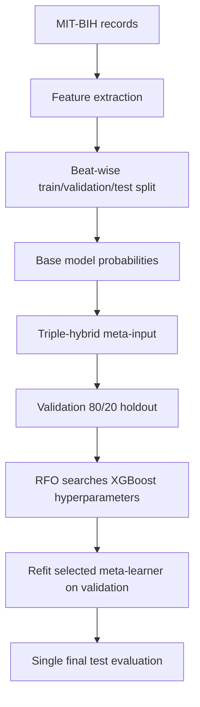

# Red Fox Optimization

The implementation in `src/07_red_fox_optimization.py` applies a Red Fox
Optimization search to the XGBoost meta-learner used by the proposed ensemble.

## Current implementation

- Objective: maximize macro-F1.
- Candidate variables: `n_estimators`, `max_depth`, `learning_rate`, `subsample`,
  `colsample_bytree`, `min_child_weight`, `reg_alpha`, and `reg_lambda`.
- Population: 12 candidates.
- Iterations: 25.
- Initialization: seeded uniform sampling within the declared bounds.
- Integer variables: estimator count, tree depth, and minimum child weight.
- Boundary handling: clipping to the declared search bounds followed by integer rounding.
- Reproducibility seed: 42.
- Fitness data: an 80/20 stratified holdout derived from validation meta-inputs.
- Final evaluation: refit the selected configuration on all validation meta-inputs,
  then evaluate once on the test meta-inputs.

The RFO script does not use test labels during candidate selection. However, the
active upstream protocol is beat-wise, so this does not establish patient-independent
generalization. The split protocol must be resolved before publication claims are made.

## Search flow

## Reproducibility notes

RFO depends on the exact upstream probability arrays generated by the base models and
ensemble stage. A reproducible release should preserve the configuration, source
revision, dependency versions, seed, search bounds, convergence history, and input
artifact hashes alongside reported metrics.